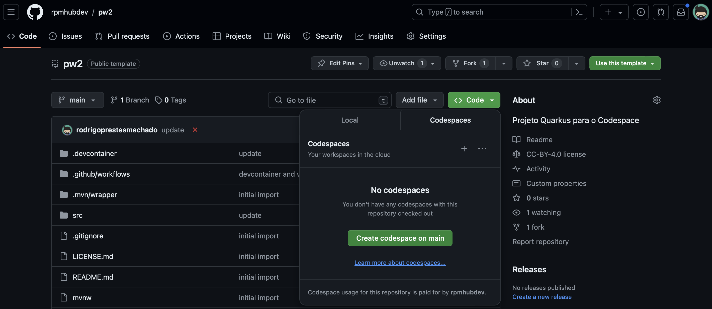

# Instalação do Quarkus

Essa página tem como o objetivo de orientar sobre a instalação do Quarkus.

## Configurando o ambiente

Antes de utilizar o Quarkus você necessita instalar o Java e o Maven na sua
máquina. Caso você esteja com essas duas ferramentas instaladas, por favor,
pule as próximas duas subseções.

### Java ♨️

Antes de iniciarmos, se faz necessário verificar se você possui uma JVM
(*Java Virtual Maquine*) e um JDK (*Java Development Kit*) 11 ou superior
instalado na sua máquina:

    java -version

Para verificar se o JDK que está instalado digite:

    javac -version

Se os comandos acima retornarem a versão do Java e do compilador, significa que
tem que a sua máquina possui o primeiro requisito para rodar o Quarkus.

Porém, se você não tiver o Java instalado na sua máquina, recomendo que você
utilize o gerenciador de SDKs [SDKMAN](https://sdkman.io) para instalar o Java.

Para instalá-lo, abra um terminal e copie e cole o seguinte comando:

    curl -s "https://get.sdkman.io" | bash

No Windows, você terá que olhar a documentação do [SDKMAN](https://sdkman.io)
para saber qual forma de instalação você irá preferir, por meio do Git Bash,
ou do WSL (Windows Subsystem for Linux), por exemplo.

O SDKMAN é uma ferramenta que permite a instalação de diversas versões do Java,
tais como: OpenJDK, Oracle JDK, Temurin, GraalVM, etc. Assim, a grande vantagem
de se utilizar o SDKMAN é que ele alterar a versão do Java que está sendo
utilizada na sua máquina de maneira descomplicada. Para saber mais sobre o
SDKMAN, por favor, consulte a [documentação](https://sdkman.io) da ferramenta.

## Quarkus IO

Uma vez que você tenha um JDK instalado na sua máquina, uma das formas mais
fáceis de iniciar um projeto com o Quarkus é acessar a página
[https://code.quarkus.io](https://code.quarkus.io). Este _site_ disponibiliza
uma ferramenta para configurar e baixar um projeto Quarkus inicial.

Assim, você poderá escolher se quer que o seu projeto tenha as suas
dependências e ciclo de *build* gerenciado por meio do
[Maven](https://maven.apache.org) ou [Gradle](https://gradle.org). Também é
possível escolher as dependências necessárias para o projeto, como por exemplo,
[RESTEasy JAX-RS](https://quarkus.io/guides/rest-json),
[Hibernate com o Panache](https://quarkus.io/guides/hibernate-orm-panache),
[Smallrye JWT](https://quarkus.io/guides/security-jwt) entre muitas outras.
Não se preocupe se caso você necessitar de novas dependências para o seu projeto,
pois, existem pelo menos mais duas formas de adicionar essas dependências no
tempo de desenvolvimento.

    
     
    Fig 1 - Quarkus.io

Depois de configurar, o site irá permitir que você faça um *download* do projeto
 no formato `.zip`. Para executar o projeto, basta descompactar e, na raiz do
 projeto (localização do arquivo pom.xml) executar o comando:

    ./mvnw compile quarkus:dev

O comando acima irá compilar o projeto e rodar a aplicação em modo de
desenvolvimento. Para acessar a aplicação, abra o navegador e digite
`http://localhost:8080`.

O Maven Wrapper (`mvnw`) é uma ferramenta que permite que você execute o
[Maven](https://maven.apache.org) sem a necessidade de instalá-lo na sua máquina.

## Codespace 🚀

Outra forma de se trabalhar com o Quarkus é por meio do [Codespace](https://github.com/features/codespaces)
do GitHub. O Codespace é um ambiente de desenvolvimento que roda
na nuvem e que permite que você desenvolva, teste e depure o seu código
diretamente do seu navegador. O Codespace utiliza o
[Visual Studio Code](https://code.visualstudio.com) como editor de código e
permite que você instale diversas extensões como a do Quarkus.

Para criar uma máquina no Codespace, procure a opção `Codespace` no seu
menu do GitHub. Logo, procure um template em branco e clique em
`Use this template`. Depois de criar uma máquina no Codespace, você pode
acessá-la por meio do navegador. Em seguida, crie um diretório oculto chamado
 `.devcontainer` e, dentro desse diretório, adicione um arquivo com o nome
 `devcontainer.json`. Copie e cope no arquivo `devcontainer.json` a [configuração](https://gist.github.com/rodrigoprestesmachado/84feb44d39bb944f4581cbb8c55e032d) do Quarkus para o Codespace abaixo:

Depois de colar a configuração no arquivo `devcontainer.json`, pressione o
atalho `ctrl + shift + p` e digite `Codespace: Rebuild Container`. Isso fará
com que o Codespace faça um *build* da máquina com a configuração que você
acabou de adicionar.

A configuração acima possui o Java 21, Maven, Docker e o Quarkus CLI. Além disso,
o VSCode irá instalar várias extensões, entre elas o Java Extension Pack e o
Quarkus para que o seu desenvolvimento seja mais confortável.

### Dicas 📌

- Crie uma máquina com pelo menos 4 cores e 16GB de memória RAM pois, isto fará
com que o seu desenvolvimento seja mais confortável no Codespaces. Para alterar
a configuração pressione `ctrl + shift + p (ou F1)` e digite
`Codespace: change machine type`. Porém, caso você opte por utilizar máquinas
mais poderosas, solicite o [Github student pack](https://education.github.com/pack)
para ter mais tempo de acesso a máquinas mais potentes no Codespace.

- Para rodar um projeto Quarkus no Codespace, abra um terminal e digite
`quarkus dev`. Isso fará com que o Quarkus rode a aplicação em modo de
desenvolvimento e você poderá acessar a aplicação por meio do navegador na porta
8080.

- Uma outra dica é abrir a porta 8080 no Codespace para que você possa acessar
a sua aplicação por meio do navegador. Para isso, procure a aba `Ports` no
VSCode e adicione a porta 8080 (privada ou pública).

## Projeto Base 🚀

Outra maneira de iniciar um novo projeto com o Quarkus é por meio do
[projeto pw2](https://github.com/rpmhubdev/pw2) no GitHub. O pw2 é um
projeto base que possui uma configuração do Codespace pronta. Neste caso, você
poderá fazer um *fork* do [projeto pw2](https://github.com/rpmhubdev/pw2) para
a sua conta e, em seguida, abrir no Codespace. Para abrir o projeto no Codespace,
entre no [repositório do projeto](https://github.com/rpmhubdev/pw2) e clique
no botão `Code` e, em seguida, clique em `Create codespace on main`. A Figura 2
ilustra o botão `Create codespace on main`. Isso fará com que o GitHub crie uma
máquina no Codespace com a configuração do Quarkus. Para rodar o projeto, abra
um terminal e digite `quarkus dev`.

    
     
    Figura 2 - Projeto base no GitHub

## Quarkus no VSCode 🖥️

A [extensão](https://marketplace.visualstudio.com/items?itemName=redhat.vscode-quarkus)
do Quarkus para o VSCode é uma ferramenta que permite que você crie,
desenvolva, gerencie dependências, teste, etc. de aplicações Quarkus diretamente
do seu editor de código. Para instalar a extensão, abra o VSCode e digite
`Quarkus` na barra de pesquisa de extensões. A extensão oficial do Quarkus
é a primeira opção que aparece na lista. Nota: se você utilizar a configuração
acima para o Codespace, essa extensão já vem instalada por padrão.

Para, por exemplo, criar um novo projeto Quarkus, pressione `ctrl + shift + p`
e digite `Quarkus: Create a Quarkus Project`. Isso fará com que o VSCode
abre uma janela para que você possa escolher o gerenciador de dependências, a
versão do Quarkus que você deseja utilizar, o nome do projeto, as dependências,
entre outras configurações.

## Quarkus CLI 📟

Outra ferramenta útil para se trabalhar com o Quarkus é por meio de sua
interface de linha de comando (_Command Line Interface_). Para instalar o
Quarkus CLI, por meio do SDKMAN, digite o seguinte comando:

    sdk install quarkus

Faça um teste para ver se o Quarkus foi instalado corretamente:

    quarkus --version

Se você digitar `quarkus --help` será possível verificar todas as
[funcionalidades do CLI](https://quarkus.io/guides/cli-tooling#using-the-cli),
entre elas: criar um projeto (app ou linha de comando), fazer um *build*, rodar
um projeto em modo de desenvolvimento, entre outros. Nota: se você utilizar a
configuração acima para o Codespace, o Quarkus CLI já vem instalada por padrão.

Um resumo (em inglês) das funcionalidades do Quarkus CLI pode ser encontrado
no vídeo [Quarkus CLI](https://www.youtube.com/watch?v=BL67jwPYvRs).

### Maven (opcional) 🌐

O Maven é uma ferramenta de automação de compilação utilizada principalmente
para projetos Java. Ele é utilizado para gerar um artefato (geralmente um
arquivo `.jar` ou `.war`) a partir do código fonte do projeto. Além disso,
o Maven gerencia as dependências do projeto, o ciclo de vida do *build*, teste e
a até mesmo a distribuição do projeto.

Para instalar o Maven utilizando o SDKMAN, digite o seguinte comando:

    sdk install maven

Apesar dos projetos Quarkus já possuírem um _wrapper_ do Maven, o `mvnw`, é
importante que você tenha o Maven instalado na sua máquina para que você possa
utilizar o Maven em outros projetos Java.

## Referências 📚

* Quarkus IO. [Quarkus.io](https://quarkus.io/). Acesso em 2024.

* Alex Soto Bueno; Jason Porter; [Quarkus Cookbook: Kubernetes-Optimized Java Solutions.](https://www.amazon.com.br/gp/product/B08D364VMD/ref=as_li_tl?ie=UTF8&camp=1789&creative=9325&creativeASIN=B08D364VMD&linkCode=as2&tag=rpmhub-20&linkId=2f82a4bb959a1797ec9791e0af68d1af) Editora: O'Reilly Media, 2020.

 
<a rel="license" href="http://creativecommons.org/licenses/by/4.0/">CC BY 4.0 DEED</a>

